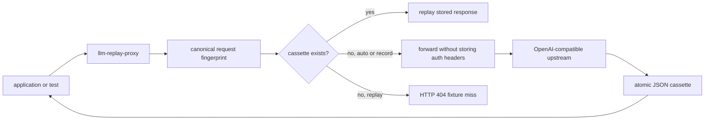

# llm-replay-proxy

[](https://github.com/mertefekurt/llm-replay-proxy/actions/workflows/ci.yml)
[](https://www.python.org/)
[](LICENSE)

**A cassette deck for LLM API calls.**

`llm-replay-proxy` sits between an application and an OpenAI-compatible API. It records complete
JSON responses on the first request, then replays them for identical requests without contacting
the provider again.

That turns costly or flaky LLM integration tests into deterministic local tests while keeping the
application's normal API client and request shape unchanged.

```text
$ llm-replay serve --upstream http://127.0.0.1:9001 --mode auto

first request    POST /v1/chat/completions    x-llm-replay: recorded
same request     POST /v1/chat/completions    x-llm-replay: hit
changed prompt   POST /v1/chat/completions    x-llm-replay: recorded
```

## Why this is useful

LLM-powered test suites often depend on a live provider. That introduces usage cost, rate limits,
network failures, and responses that change between runs. This proxy creates reviewable JSON
fixtures from real calls and makes replay mode fully offline.

It is deliberately narrower than a general HTTP recorder:

- fingerprints parsed JSON, so object key order and query parameter order do not create false misses
- supports `auto`, `record`, and offline `replay` workflows
- never writes authorization headers or API keys to cassettes
- exposes hit, miss, forward, and recording counters
- returns clear HTTP errors for missing fixtures, bad upstreams, and unsupported streaming
- works with OpenAI-compatible endpoints and existing SDK base URL settings

## Install

Python 3.11 or newer is required.

```bash
git clone https://github.com/mertefekurt/llm-replay-proxy.git
cd llm-replay-proxy
python -m venv .venv
source .venv/bin/activate
python -m pip install -e .
```

Install development tools with:

```bash
python -m pip install -e ".[dev]"
```

## Try it without an API key

The repository includes a small compatible upstream for a zero-cost demo.

Terminal 1:

```bash
python examples/mock_upstream.py
```

Terminal 2:

```bash
llm-replay serve --upstream http://127.0.0.1:9001 --mode auto
```

Terminal 3:

```bash
curl -i http://127.0.0.1:8787/v1/chat/completions \
  -H "content-type: application/json" \
  --data @examples/request.json
```

Stop the mock upstream and repeat the request. The proxy still returns the recorded response.

To point an OpenAI SDK at the proxy, use `http://127.0.0.1:8787/v1` as its base URL. Keep the
provider base at the host level:

```bash
export OPENAI_API_KEY="..."
llm-replay serve \
  --upstream https://api.openai.com \
  --auth-env OPENAI_API_KEY \
  --mode auto
```

The token is read at request time, forwarded as a bearer token, and excluded from cassette files.

## Modes

| Mode | Cache hit | Cache miss | Best use |
| --- | --- | --- | --- |
| `auto` | replay | forward and record | local development |
| `record` | forward and replace | forward and record | deliberately refreshing fixtures |
| `replay` | replay | return HTTP 404 | offline tests and CI |

Requests are keyed by HTTP method, path, sorted query parameters, and canonical JSON body. A real
prompt, model, tool definition, or generation setting change therefore creates a new cassette.

## CLI reference

```text
llm-replay serve [--upstream URL] [--mode auto|record|replay]
                 [--cassette-dir PATH] [--host HOST] [--port PORT]
                 [--timeout SECONDS] [--auth-env NAME] [--log-level LEVEL]

llm-replay inspect [CASSETTE_DIR] [--format text|json]
```

Useful checks:

```bash
curl http://127.0.0.1:8787/_replay/health
curl http://127.0.0.1:8787/_replay/stats
llm-replay inspect .llm-replay
llm-replay inspect .llm-replay --format json
```

Streaming requests (`"stream": true`) return HTTP 422 because a partial-response recorder needs a
different persistence model. Non-streaming JSON endpoints are the intentional scope.

## Request flow



Each cassette contains the canonical request body, response body, safe response headers, status
code, and recording timestamp. Writes use a temporary file followed by an atomic replace so an
interrupted refresh does not leave a partial fixture.

## Tests

```bash
ruff check .
ruff format --check .
pytest
python -m llm_replay_proxy --help
```

The suite covers stable fingerprints, query normalization, cassette corruption, atomic
round-trips, all three modes, auth handling, network failures, replay misses, metrics, streaming
rejection, and CLI inspection. GitHub Actions runs the checks on Python 3.11, 3.12, and 3.13.

## License

MIT
