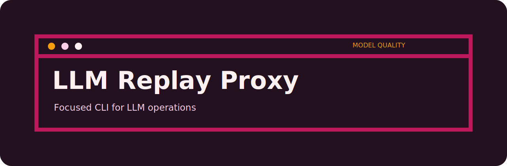
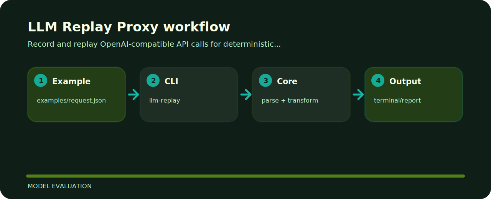

# LLM Replay Proxy

Record and replay OpenAI-compatible API calls for deterministic local tests.



## Where things live

```text
.github/        CI workflow
examples/       sample inputs
src/            package source
tests/          test coverage
.gitignore      project file
```

## Shape of the tool



## Start here

```bash
git clone https://github.com/mertefekurt/llm-replay-proxy.git
cd llm-replay-proxy
python -m pip install -e ".[dev]"
llm-replay examples/request.json
```

## Why this shape

- Designed as a focused model evaluation repo.
- Keeps setup short.
- Prioritizes readable output over infrastructure.
